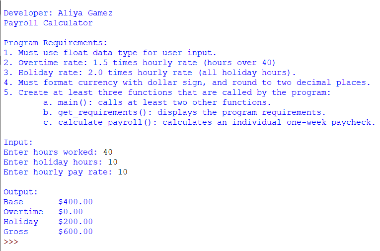
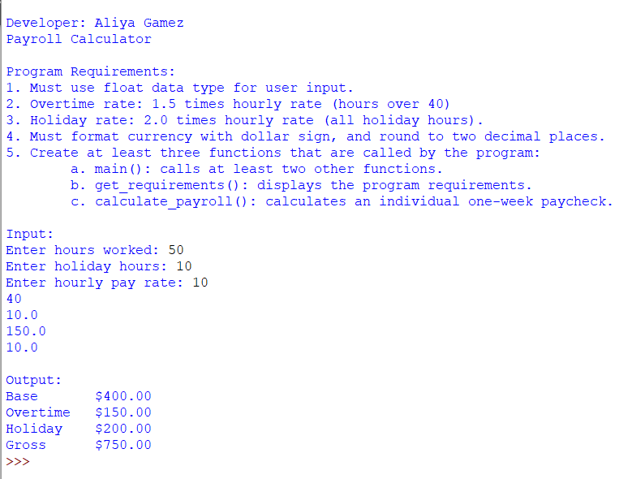
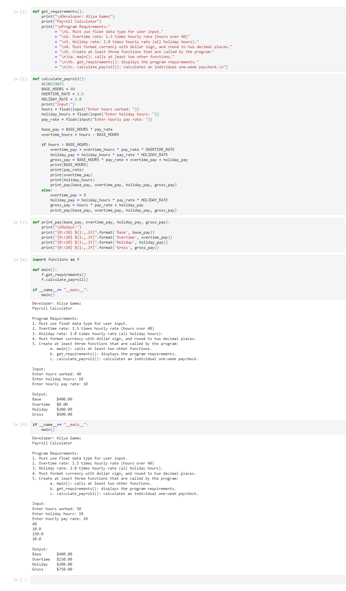
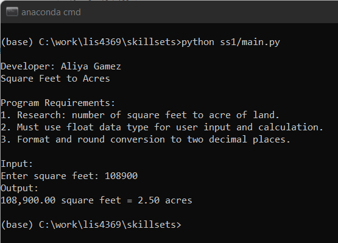
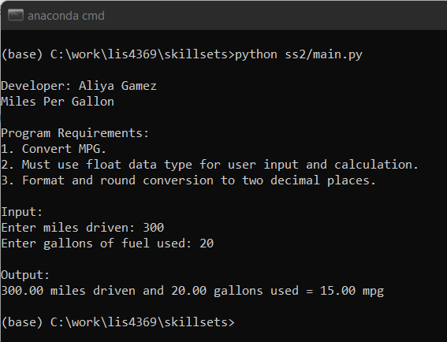
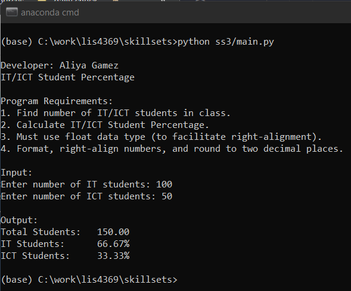

# LIS4369 - Extensible Enterprise Solutions

## Aliya Gamez

### Assignment 2 Requirements:

*Four Parts*

1. Create functions.py and main.py module and import.
2. Functions.py should contain get_requirements(), calculate_payroll() and print_pay().
3. Screenshots of functions including Jupyter Notebook.
3. Upload A2 .ipynb file.

#### Assignment Screenshots:

| <b>Payroll No Overtime</b> | <b>Payroll with Overtime</b> |
| :--: | :--: |
|  |  |

 

| <b>Screenshot of a2_payroll.ipynb</b> |
| :--: |
|  |

 

#### Skillset Screenshots:

| <b>Screenshot of SS1 - Square Feet to Acres</b> |
| -- |
|  |

| <b>Screenshot of SS2 - Miles Per Gallon</b> |
| -- |
|  |

| <b>Screenshot of SS3 - IT/ICT Student Percentage</b> |
| -- |
|  |

 

#### Assignment Deliverables

1. [a2.ipynb](python/a2_payroll.ipynb)

