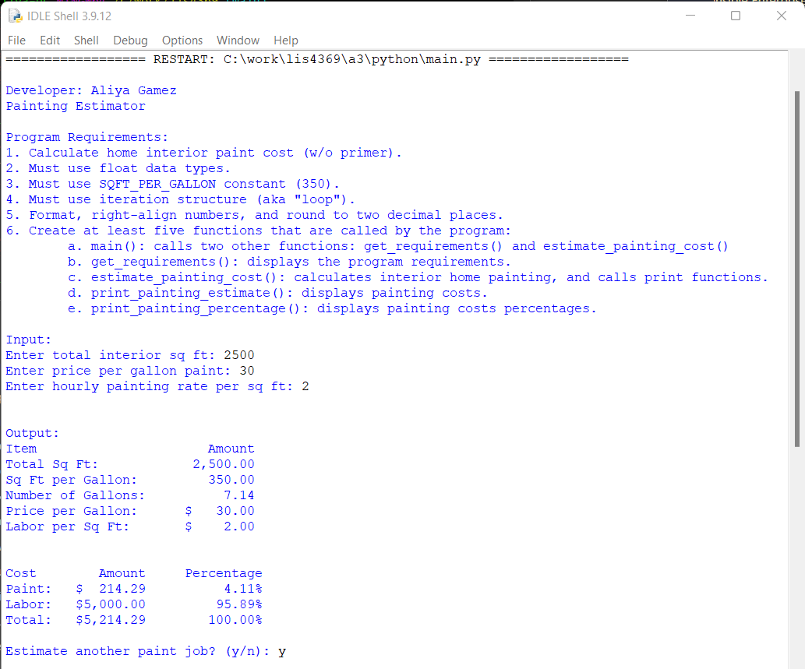
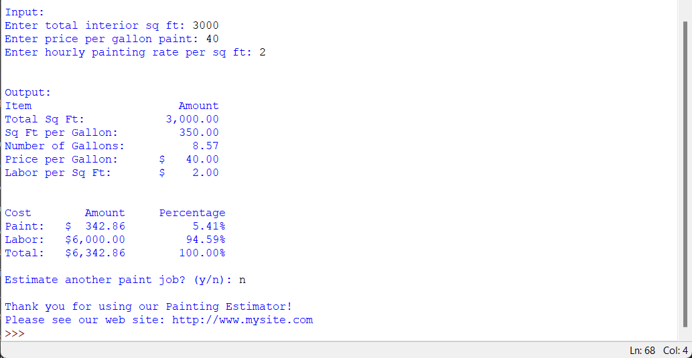
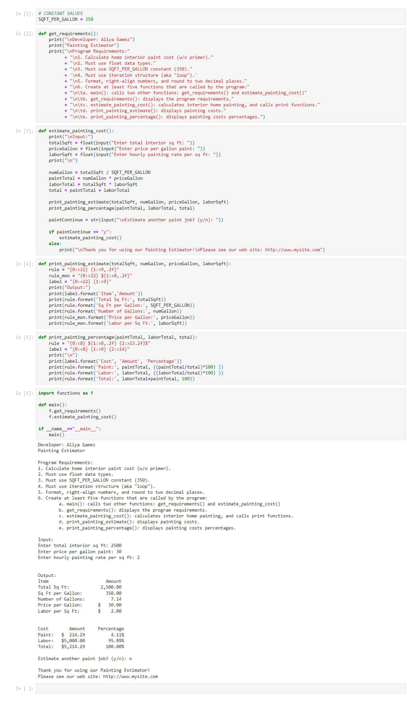
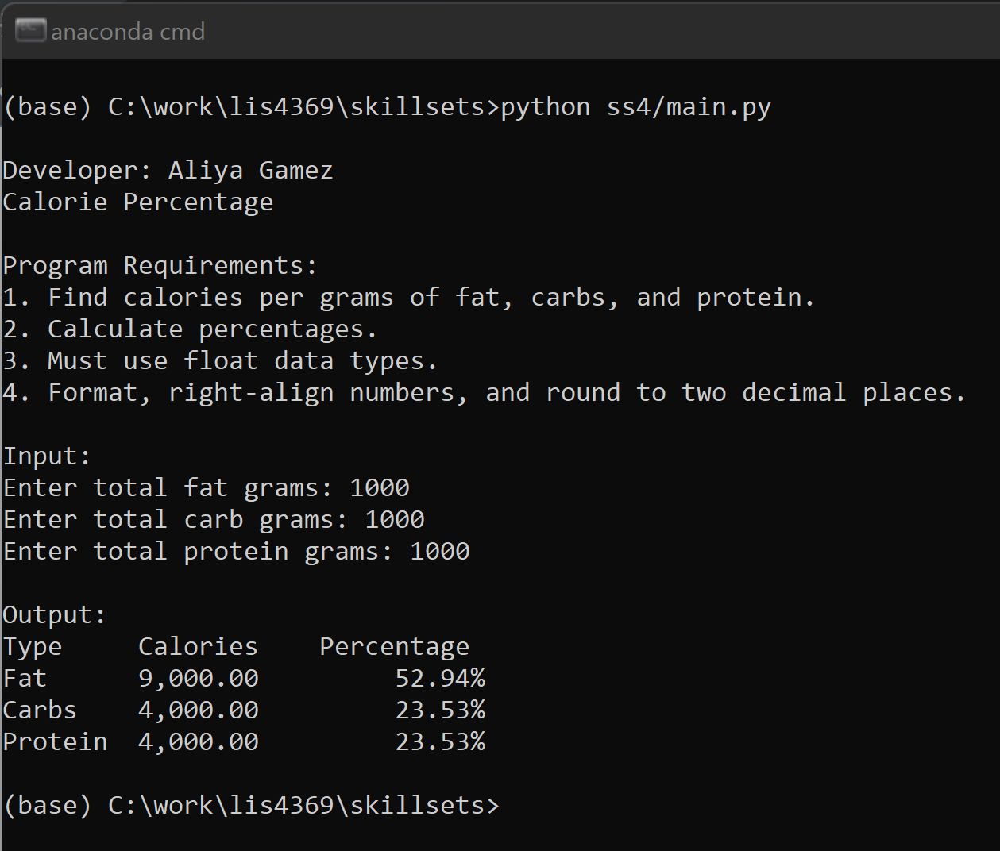
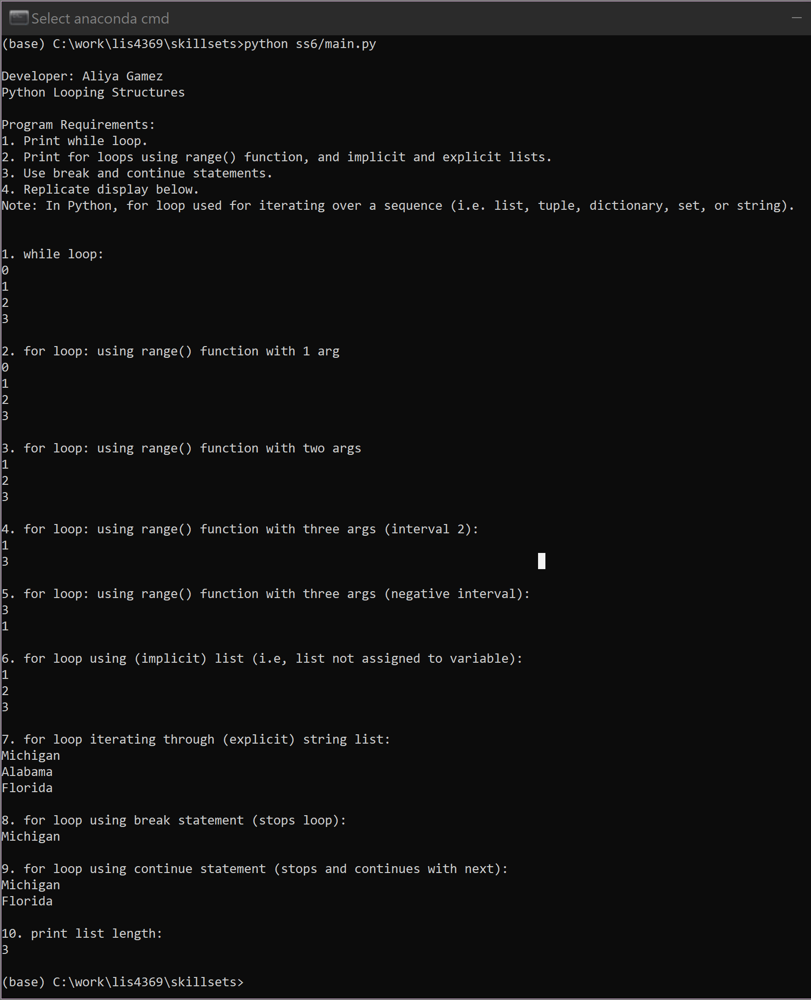

# LIS4369 - Extensible Enterprise Solutions

## Aliya Gamez

### Assignment 3 Requirements:

*Four Parts*

1. Create functions.py and main.py module and import.
2. Functions.py should contain get_requirements, estimate_painting_cost, print_painting_estimate and print_painting_percentage functions.
3. Screenshots of main.py and functions.py modules running IDLE including Jupyter Notebook.
3. Upload a3.ipynb file.

#### Assignment Screenshots:

| <b>Painting Estimator</b> |
| :--: |
|  |
|  |

 

| <b>Screenshot of a3.ipynb</b> |
| :--: |
|  |

 

#### Skillset Screenshots:

| <b>Screenshot of SS4 - Calorie Percentage</b> |
| -- |
|  |

| <b>Screenshot of SS5 - Python Selection Structures</b> |
| -- |
|  |

| <b>Screenshot of SS6 - Python Loops</b> |
| -- |
|  |

#### Assignment Deliverables

1. [a3.ipynb](python/a3.ipynb)

