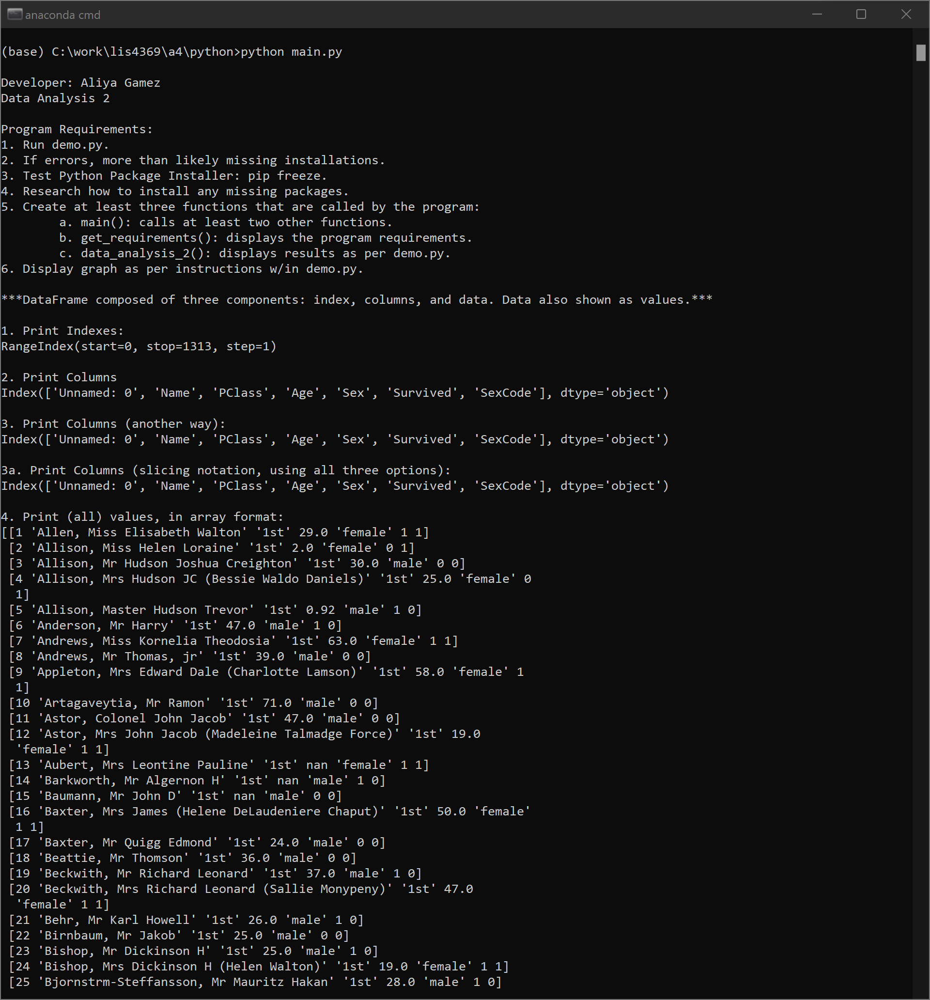
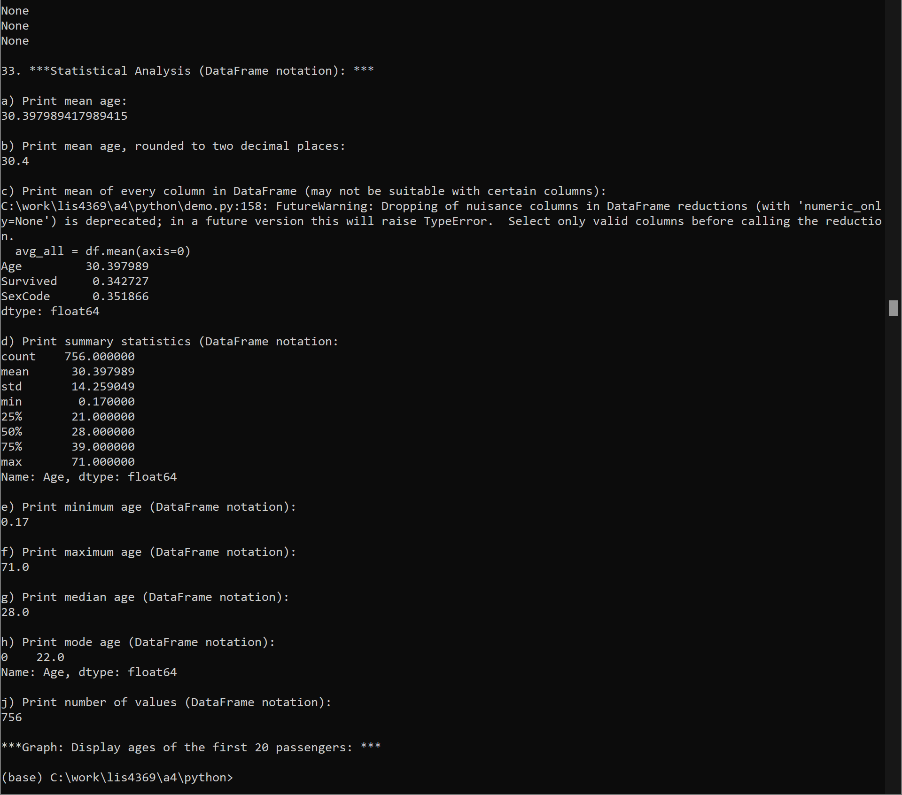
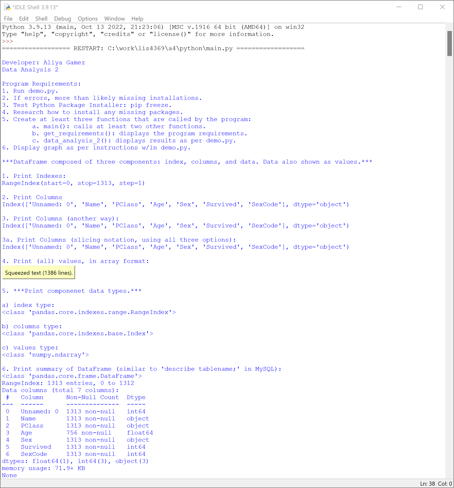
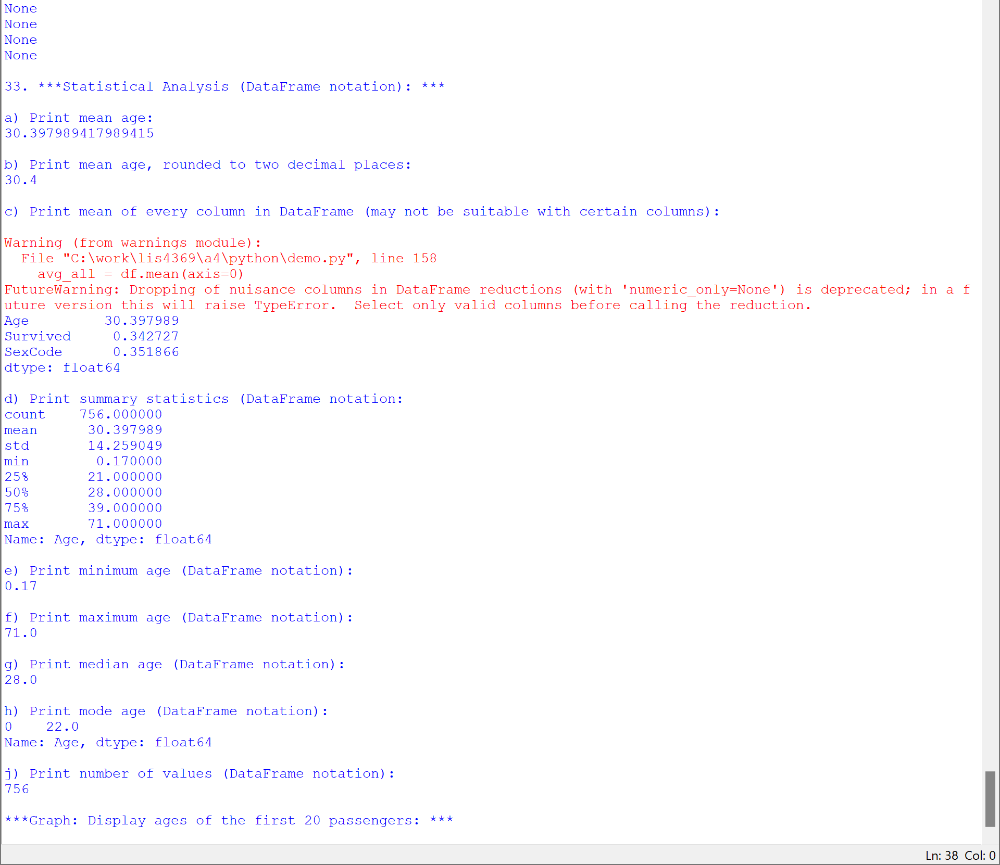
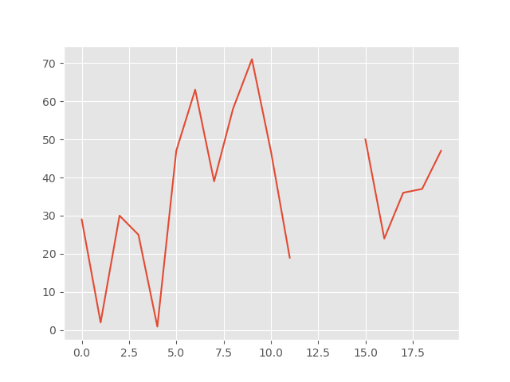
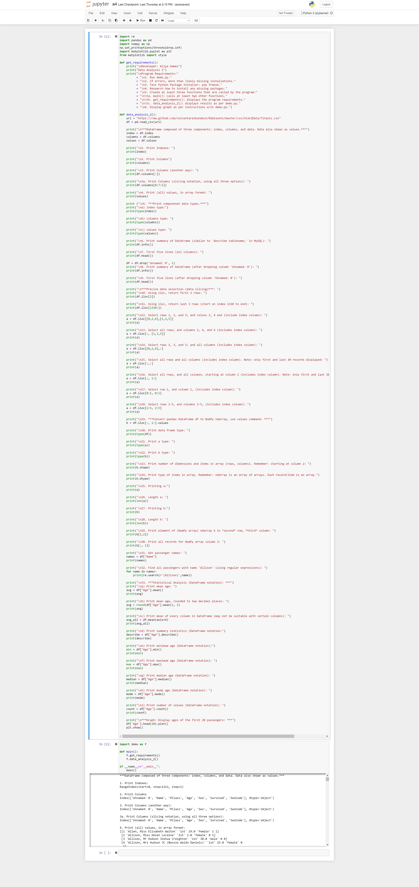
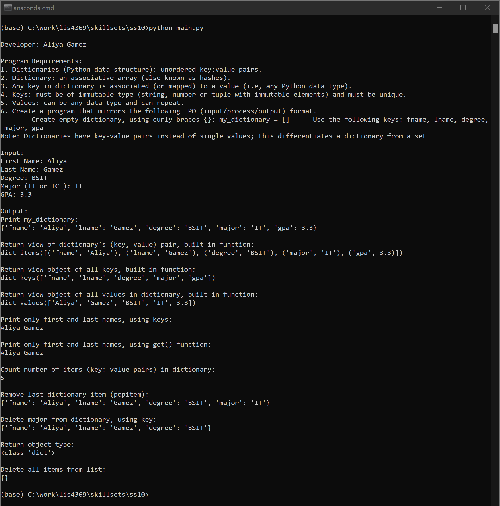
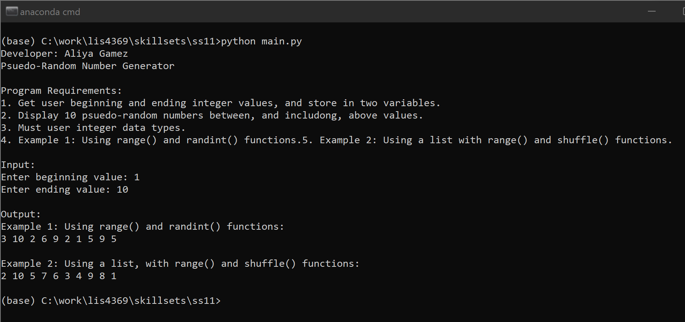
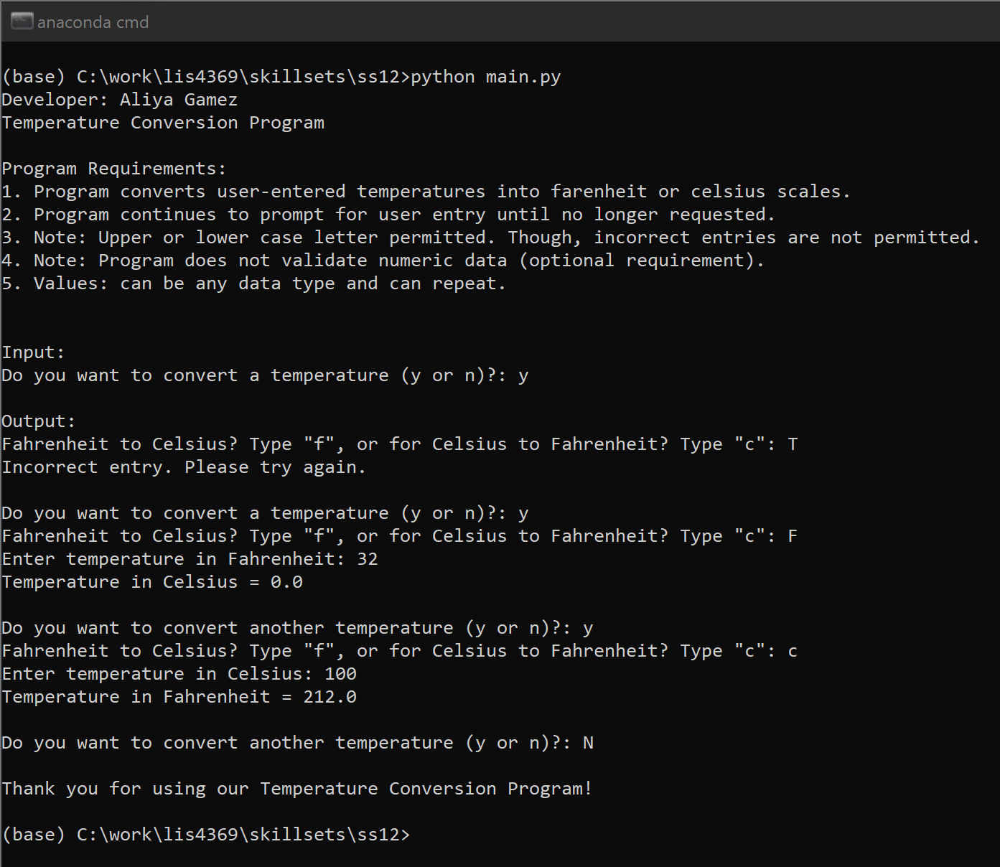

# LIS4369 - Extensible Enterprise Solutions

## Aliya Gamez

### Assignment 4 Requirements:

*Four Parts*

1. Review video and Backward-engineer demo.py (Data Analysis 2) program.
2. Screenshots of demo.py, demo.py graph including Jupyter Notebook.
3. Upload a4.ipynb file.
4. Screenshots of Skillsets 10-12.

#### Assignment Screenshots:

| <b>Data Analysis 2 - Anaconda Command Prompt</b> |
| :--: |
|  |
|  |

| <b>Data Analysis 2 - IDLE</b> |
| :--: |
|  |
|  |

 

| <b>Graph</b> |
| :--: |
|  |

 

| <b>Screenshot of a4.ipynb</b> |
| :--: |
|  |

#### Skillset Screenshots:

| <b>Screenshot of SS10 - Using Dictionaries</b> |
| -- |
|  |

| <b>Screenshot of SS11 - Random Number Generator</b> |
| -- |
|  |

| <b>Screenshot of SS12 - Temperature Conversion Program/b> |
| -- |
|  |

#### Assignment Deliverables

1. [a4.ipynb](python/a4.ipynb)

