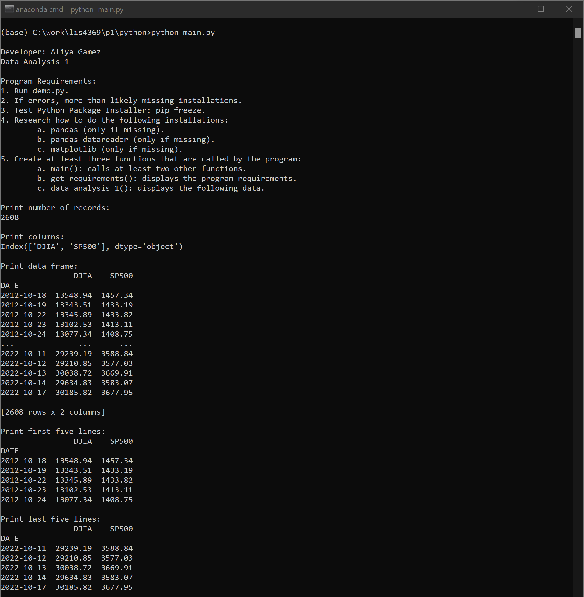
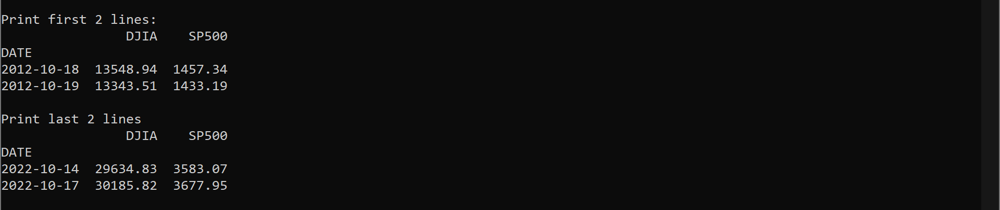
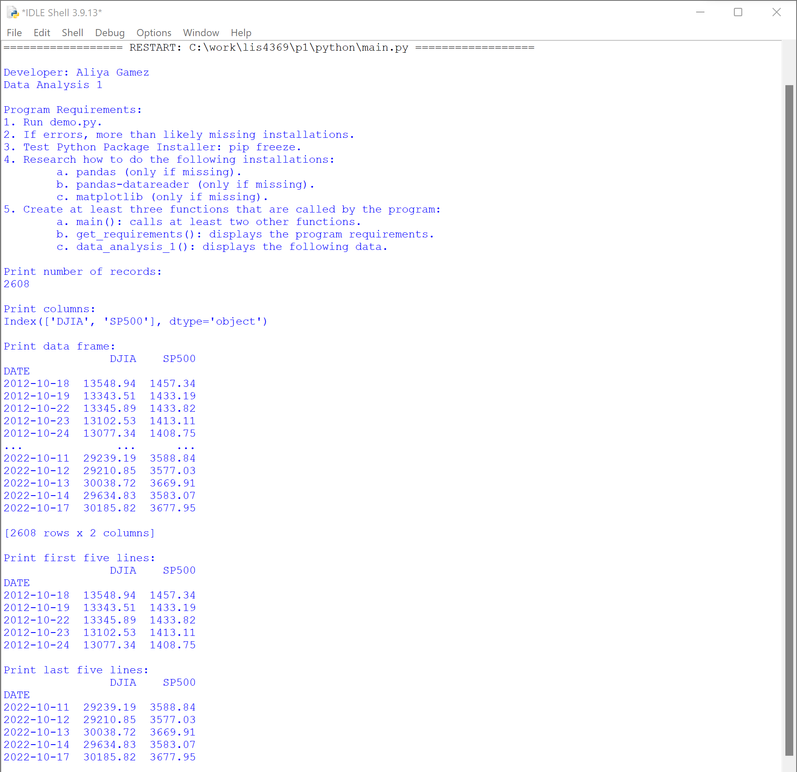
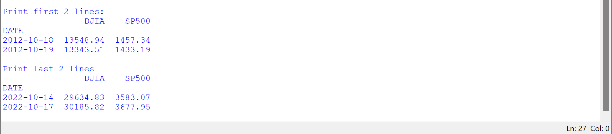
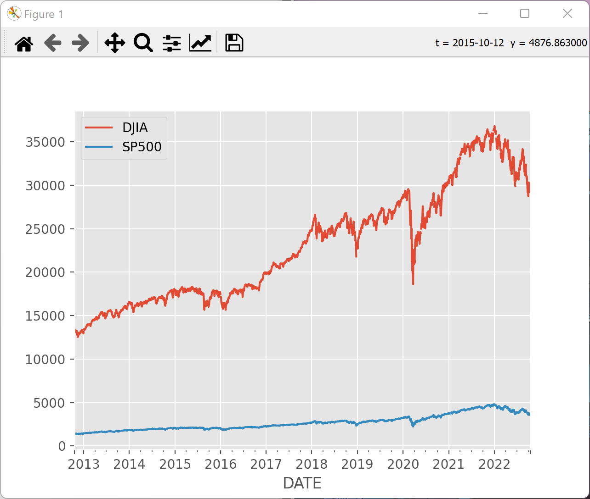
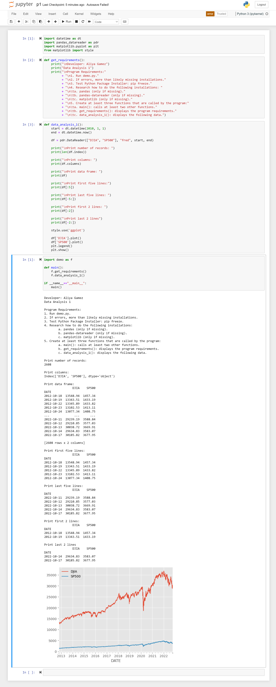
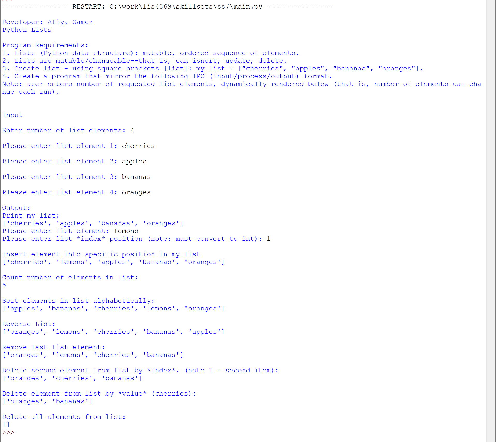
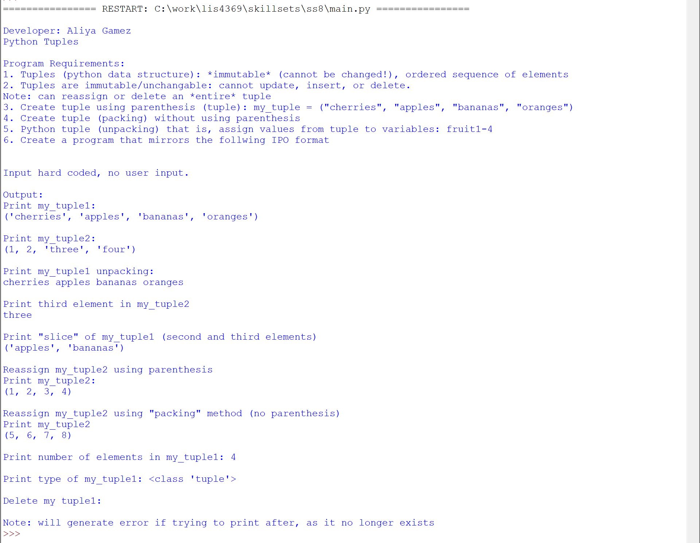
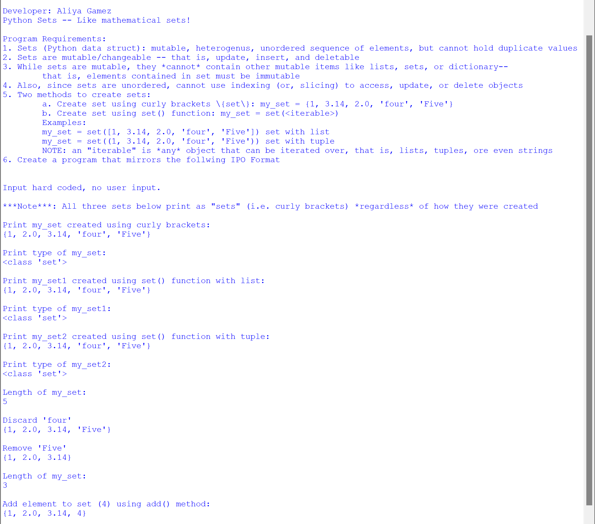
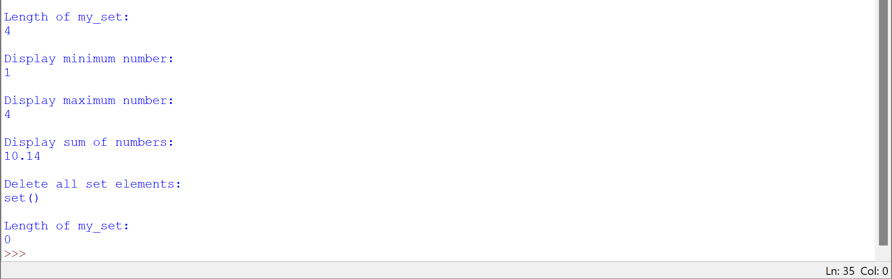

# LIS4369 - Extensible Enterprise Solutions

## Aliya Gamez

### Project 1 Requirements:

*Five Parts*

1. Backward-engineer demo.py program screenshots..
2. Test program using both IDLE and Visual Studio Code
3. Screenshots of demo.py, demo.py graph including Jupyter Notebook.
4. Upload p1.ipynb file.
5. Screenshots of Skillsets 7-9.

#### Project Screenshots:

| <b>Data Analysis 1 - Anaconda Command Prompt</b> |
| :--: |
|  |
|  |

| <b>Data Analysis 1 - IDLE</b> |
| :--: |
|  |
|  |

 

| <b>Graph</b> |
| :--: |
|  |

 

| <b>Screenshot of p1.ipynb</b> |
| :--: |
|  |

#### Skillset Screenshots:

| <b>Screenshot of SS7 - Using Lists</b> |
| -- |
|  |

| <b>Screenshot of SS8 - Using Tuples</b> |
| -- |
|  |

| <b>Screenshot of SS9 - Using Sets/b> |
| -- |
|  |
|  |

#### Project Deliverables

1. [p1.ipynb](python/p1.ipynb)

