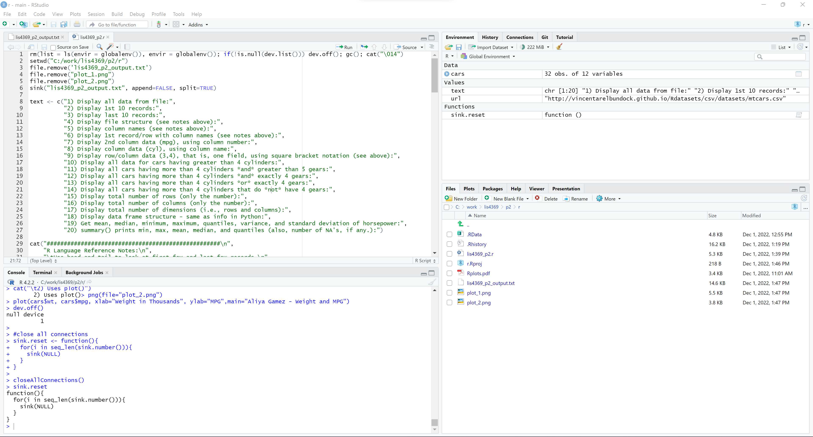
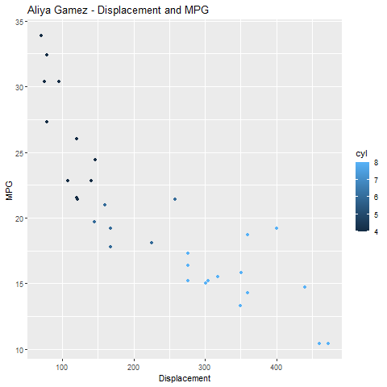
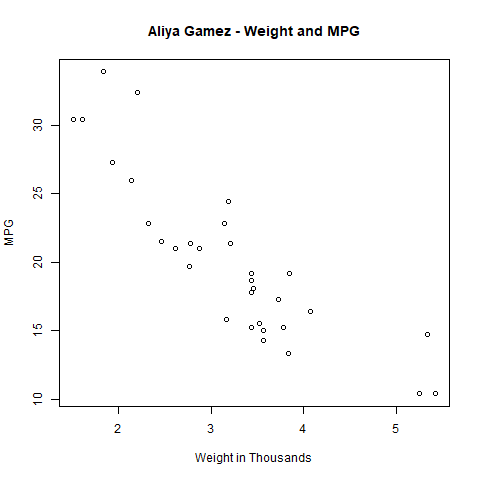

# LIS4369 - Extensible Enterprise Solutions

## Aliya Gamez

### Project 2 Requirements:

*Three Parts*

1. Backward-enginner lis469_p2_requirements.txt with an output file.
2. Screenshots of lis4359_p2.r (4-panel), and two plots.
3. Upload lis4359_p2.r and lis4359_p2_output.txt

#### Project Screenshots:

| <b>lis4369_p2.R (RStudio 4-panel Screenshot)</b> |
| :--: |
|  |

| <b>Plot 1</b> | <b>Plot 2</b>
| :--: | :--: |
|  |  |

#### Project Deliverables

1. [lis4369_p2.R](r/lis4369_p2.r)
2. [lis4369_p2_output.txt](r/lis4369_p2_output.txt)
3. [LIS4331 Repo](https://bitbucket.org/aeg19h/lis4331/src/main/)
4. [LIS4381 Repo](https://bitbucket.org/aeg19h/lis4381/src/master/)

